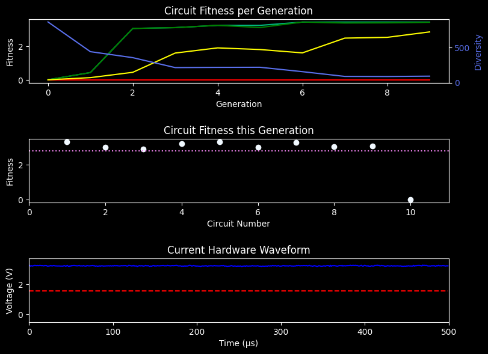

; This configuration file was generated through combining the following files:  
; data/config.ini  
; data/default_config.ini  
  
#### [TOP-LEVEL PARAMETERS]  
simulation_mode = FULLY_INTRINSIC  
  
#### [FITNESS PARAMETERS]  
fitness_func = VARIANCE  
desired_freq = 10000  
; Options:  ADD (adds the two fitness measures together with weighting)  
;			MULT (multiplies the two fitness measures together)  
combined_mode = MULT  
pulse_weight = 2  
var_weight = 0  
; Number of samples to record in pulse count fitness functions  
; The minimum number recorded will be used to determine the actual pulse fitness  
; Higher number of samples will take longer to run, but should result in more stable circuits  
num_samples = 1  
; Number of passes to go through each circuit in a single generation  
; This means it will evaluate circuit 1, 2, 3, ... and then 1, 2, 3, ... again  
; The lowest fitness from these overall passes will be used  
; Total samples recorded in each generation is num_samples * num_passes * population_size  
num_passes = 1  
  
#### [GA PARAMETERS]  
population_size = 50  
mutation_probability = 0.0021  
crossover_probability = 0.7  
elitism_fraction = 0.1  
selection = FIT_PROP_SEL  
diversity_measure = HAMMING_DIST  
random_injection = 0.0  
  
#### [INITIALIZATION PARAMETERS]  
init_mode = RANDOM  
randomize_until = NO  
randomize_threshold = 0  
randomize_mode = RANDOM  
  
#### [STOPPING CONDITION PARAMETERS]  
generations = 10  
target_fitness = IGNORE  
  
#### [LOGGING PARAMETERS]  
log_level = 4  
save_log = true  
save_plots = true  
backup_workspace = true  
log_file = ./workspace/log  
plots_dir = ./workspace/plots  
output_dir = ./prev_workspaces  
asc_dir = ./workspace/experiment_asc  
bin_dir = ./workspace/experiment_bin  
data_dir = ./workspace/experiment_data  
analysis = ./workspace/analysis  
best_file = ./workspace/best.asc  
src_populations_dir = ./workspace/source_populations  
monitor_file = /home/ubuntu/BitstreamEvolution/data/monitor  
generations_dir = ./workspace/generations  
datetime_format = %%m/%%d/%%Y - %%H:%%M:%%S  
show_ovr_best = true  
  
#### [SYSTEM PARAMETERS]  
fpga = i:0x0403:0x6010:0  
usb_path = /dev/ttyUSB0  
; If set true, will compile the arduino code and upload it every experiment  
auto_upload_to_arduino = false  
  
#### [HARDWARE PARAMETERS]  
routing = MOORE  
mcu_read_timeout = 1.5  
serial_baud = 115200  
accessed_columns = 14,15,24,25,40,41  
configurable_io = false  
input_pins = 45,47,48  
output_pins = 44  
  
#### [FITNESS SENSITIVITY PARAMETERS]  
; Paramters for the INTRINSIC_SENSITIVITY simulation mode  
; Specifies the asc file to test  
test_circuit = data/test.asc  
; Fitness sensitivity experiments will run until one of the following stop conditions is met  
; Specifies how many trials to do  
sensitivity_trials = IGNORE  
; Specifies how long to run trials for (%H:%M:%S)  
sensitivity_time = 24:00:00  
  
#### [TRANSFERABILITY PARAMETERS]  
; Parameters for testing evolution across two different fpgas  
transfer_interval = IGNORE  
fpga2 = i:0x0403:0x6010:0  
  
-----

; This configuration file was generated through combining the following files:  
; data/config.ini  
; data/default_config.ini  
  
#### [TOP-LEVEL PARAMETERS]  
simulation_mode = FULLY_INTRINSIC  
  
#### [FITNESS PARAMETERS]  
fitness_func = VARIANCE  
desired_freq = 10000  
; Options:  ADD (adds the two fitness measures together with weighting)  
;			MULT (multiplies the two fitness measures together)  
combined_mode = MULT  
pulse_weight = 2  
var_weight = 0  
; Number of samples to record in pulse count fitness functions  
; The minimum number recorded will be used to determine the actual pulse fitness  
; Higher number of samples will take longer to run, but should result in more stable circuits  
num_samples = 1  
; Number of passes to go through each circuit in a single generation  
; This means it will evaluate circuit 1, 2, 3, ... and then 1, 2, 3, ... again  
; The lowest fitness from these overall passes will be used  
; Total samples recorded in each generation is num_samples * num_passes * population_size  
num_passes = 1  
  
#### [GA PARAMETERS]  
population_size = 50  
mutation_probability = 0.0021  
crossover_probability = 0.7  
elitism_fraction = 0.1  
selection = FIT_PROP_SEL  
diversity_measure = HAMMING_DIST  
random_injection = 0.0  
  
#### [INITIALIZATION PARAMETERS]  
init_mode = RANDOM  
randomize_until = NO  
randomize_threshold = 0  
randomize_mode = RANDOM  
  
#### [STOPPING CONDITION PARAMETERS]  
generations = 10  
target_fitness = IGNORE  
  
#### [LOGGING PARAMETERS]  
log_level = 4  
save_log = true  
save_plots = true  
backup_workspace = true  
log_file = ./workspace/log  
plots_dir = ./workspace/plots  
output_dir = ./prev_workspaces  
asc_dir = ./workspace/experiment_asc  
bin_dir = ./workspace/experiment_bin  
data_dir = ./workspace/experiment_data  
analysis = ./workspace/analysis  
best_file = ./workspace/best.asc  
src_populations_dir = ./workspace/source_populations  
monitor_file = /home/ubuntu/BitstreamEvolution/data/monitor  
generations_dir = ./workspace/generations  
datetime_format = %%m/%%d/%%Y - %%H:%%M:%%S  
show_ovr_best = true  
  
#### [SYSTEM PARAMETERS]  
fpga = i:0x0403:0x6010:0  
usb_path = /dev/ttyUSB0  
; If set true, will compile the arduino code and upload it every experiment  
auto_upload_to_arduino = false  
  
#### [HARDWARE PARAMETERS]  
routing = MOORE  
mcu_read_timeout = 1.5  
serial_baud = 115200  
accessed_columns = 14,15,24,25,40,41  
configurable_io = false  
input_pins = 45,47,48  
output_pins = 44  
  
#### [FITNESS SENSITIVITY PARAMETERS]  
; Paramters for the INTRINSIC_SENSITIVITY simulation mode  
; Specifies the asc file to test  
test_circuit = data/test.asc  
; Fitness sensitivity experiments will run until one of the following stop conditions is met  
; Specifies how many trials to do  
sensitivity_trials = IGNORE  
; Specifies how long to run trials for (%H:%M:%S)  
sensitivity_time = 24:00:00  
  
#### [TRANSFERABILITY PARAMETERS]  
; Parameters for testing evolution across two different fpgas  
transfer_interval = IGNORE  
fpga2 = i:0x0403:0x6010:0  
  
-----

