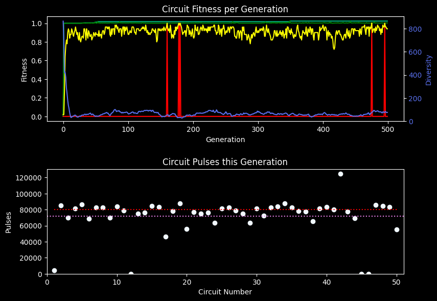
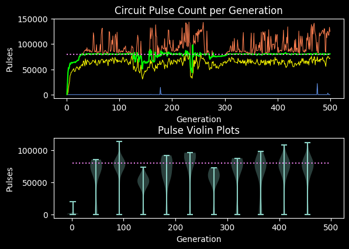
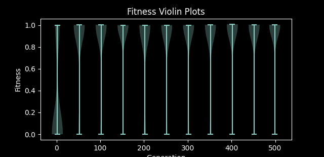
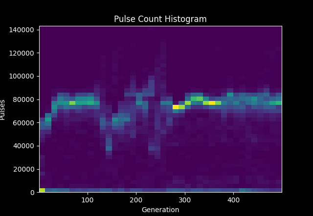

80k Sensitive  
-----

-----
#### [TOP-LEVEL PARAMETERS]  
| Param | Value |  
|---|---|  
simulation_mode | FULLY_INTRINSIC  
#### [FITNESS PARAMETERS]  
| Param | Value |  
|---|---|  
fitness_func | SENSITIVE_PULSE_COUNT  
desired_freq | 80000  
combined_mode | MULT  
pulse_weight | 2  
var_weight | 0  
num_samples | 2  
num_passes | 1  
#### [GA PARAMETERS]  
| Param | Value |  
|---|---|  
population_size | 50  
mutation_probability | 0.0021  
crossover_probability | 0.7  
elitism_fraction | 0.1  
selection | FIT_PROP_SEL  
diversity_measure | HAMMING_DIST  
random_injection | 0.0  
#### [INITIALIZATION PARAMETERS]  
| Param | Value |  
|---|---|  
init_mode | RANDOM  
randomize_until | PULSE  
randomize_threshold | 0  
; Note: Randomization goes through the population. Therefore, if doing MUTATE with CLONE_SEED and pop size | 50, for example,  
randomize_mode | RANDOM  
#### [STOPPING CONDITION PARAMETERS]  
| Param | Value |  
|---|---|  
generations | 500  
target_fitness | IGNORE  
#### [FITNESS SENSITIVITY PARAMETERS]  
| Param | Value |  
|---|---|  
test_circuit | data/test.asc  
sensitivity_trials | 1000  
#### [LOGGING PARAMETERS]  
| Param | Value |  
|---|---|  
; Higher log level | more detailed logs  
log_level | 4  
save_log | true  
save_plots | true  
backup_workspace | true  
log_file | ./workspace/log  
plots_dir | ./workspace/plots  
output_dir | ./prev_workspaces  
asc_dir | ./workspace/experiment_asc  
bin_dir | ./workspace/experiment_bin  
data_dir | ./workspace/experiment_data  
analysis | ./workspace/analysis  
best_file | ./workspace/best.asc  
generations_dir | ./workspace/generations  
src_populations_dir | ./workspace/source_populations  
datetime_format | %%m/%%d/%%Y - %%H:%%M:%%S  
#### [TRANSFERABILITY PARAMETERS]  
| Param | Value |  
|---|---|  
transfer_interval | IGNORE  
fpga2 | i:0x0403:0x6010:1  
#### [SYSTEM PARAMETERS]  
| Param | Value |  
|---|---|  
fpga | i:0x0403:0x6010:0  
usb_path | /dev/ttyUSB0  
auto_upload_to_arduino | false  
#### [HARDWARE PARAMETERS]  
| Param | Value |  
|---|---|  
routing | MOORE  
mcu_read_timeout | 1.1  
serial_baud | 115200  
accessed_columns | 14,15,24,25,40,41  
configurable_io | false  
input_pins | 45,47,48  
output_pins | 44  
